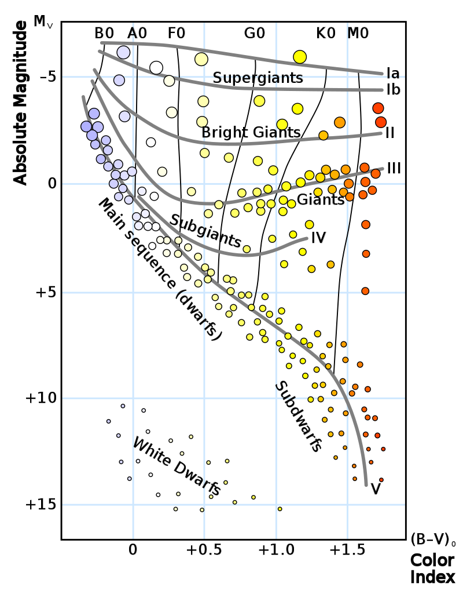
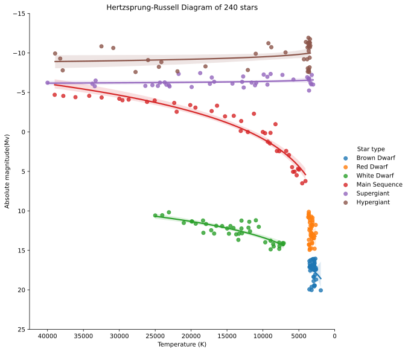

# ACM Research coding challenge (Spring 2023)

My goal for this project was to create an easy way to generate Hertzsprung-Russell diagrams from a star dataset containing their magnitude, temperature, and classification. These diagrams would then be exported into SVGs for use in presentations, research materials, or GitHub readmes. Here are the results:

[Final Diagram](./fig_no_regression.svg)

[Final Diagram with trend lines](./fig_regression.svg)

[View Notebook on Kaggle](https://www.kaggle.com/code/spresto/acm-research-s23)

# How I did it

I first read the CSV file using Pandas. This created a dataframe that I could then use with Seaborn to create a scatter plot. 
```python
star_df = pd.read_csv(get_dataset_path())
```

Before I could do that though, I needed to convert the ```Star Type``` column from a numeric index to their actual names. I did this by using a mapping function and a tuple containing the type names.
```python
def star_type_index_to_name(index: int):
    NAMES = ('Brown Dwarf','Red Dwarf','White Dwarf','Main Sequence','Supergiant','Hypergiant')
    return NAMES[index]

star_df['Star type'] = star_df['Star type'].map(star_type_index_to_name)
```

I was then able to use Seaborn to create a scatter plot that used the stars' temperatures as the X-Axis and magnitudes as the Y-Axis. I also scaled each dot according to each star's size.
```python
fig_noreg, ax_noreg = plt.subplots(figsize=(10, 10))
sns.scatterplot(data=star_df, x='Temperature (K)', y='Absolute magnitude(Mv)', hue='Star type', size='Radius(R/Ro)', ax=ax_noreg)
```

However, this created a graph that was reversed compared to a proper Hertzsprung-Russell diagram. This is because the diagram decreases in value upwards along the Y-Axis and also decreases along the X-Axis. To fix this, I overwrote the axis limits for the plot. I also gave the plot a title.
```python
Y_LIMITS = (25, -15) # Abs Magnitude that decreases upwards along the y-axis
X_LIMITS = (42500, 0) # Temperature that decreases along the x-axis
TITLE = f'Hertzsprung-Russell Diagram of {len(star_df)} stars'
ax_noreg.set(xlim=X_LIMITS, ylim=Y_LIMITS, title=TITLE)
fig_noreg.savefig('fig_no_regression.svg')
```

Finally, this created the proper plot:


If you compare this plot to this example one below, you can see that the stars follow the same trend and correctly group together based on their type.


As an experiment, I also graphed the regression trend lines for each type of star.
```python
fig_reg = sns.lmplot(data=star_df, x='Temperature (K)', y='Absolute magnitude(Mv)', hue='Star type', logx=True, height=8)
fig_reg.set(xlim=X_LIMITS, ylim=Y_LIMITS, title=TITLE)
fig_reg.savefig('fig_regression.svg')
```


Overall, this project proved to be very valuable considering how small it is. It taught me how to use Seaborn and how to export plots as SVGs, two very useful skills for future research applications.

# Sources
* Libraries used: Matplotlib, Pandas, Seaborn, and Statsmodels
* https://www.kaggle.com/datasets/deepu1109/star-dataset
* https://en.wikipedia.org/wiki/Stellar_classification
